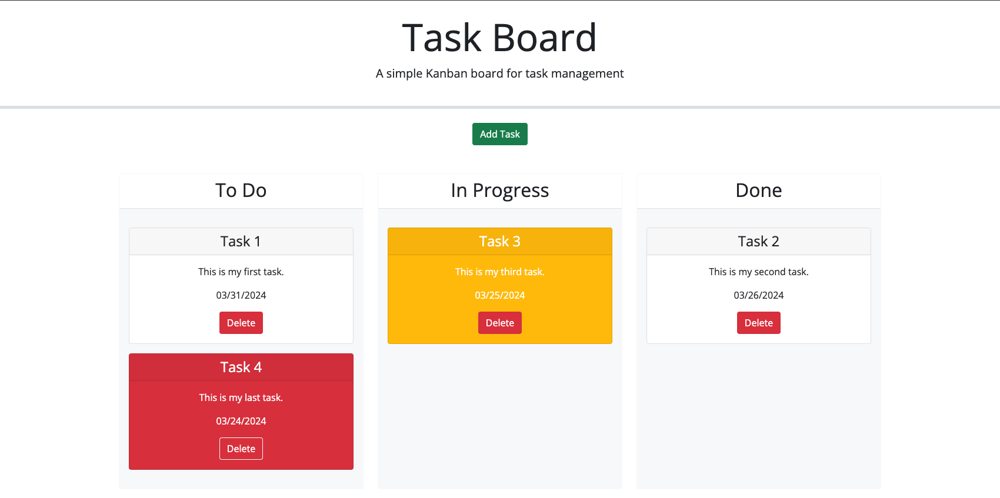

# Task Board Starter Code

## Description
This project was created to learn the essence of jQuery, jQueryUI, and Day.js along with reinforcing the idea of localStorage persistant data.

## Installation
To install this repo, simply copy the repo and use git clone in your command line along with the copied repo url with your preferred method.

```bash
git clone git@github.com:andrewhamerly/task-board.git
```

## Usage
This can be used to record and store task items in localStorage that can be updated in a kanban style board from to-do to in-progress to done and ultimately deleted.

Link to deployed application:
[Task Boad](https://andrewhamerly.github.io/task-board/)



## Credits
Module 5 Mini Project helped me to reverse engineer many aspects of this app including the function to create cards and function for handleDeleteTask.

ChatGPT helped to brainstorm the below three aspects when asked about the snap abilities for the jQueryUI droppable method.
       `tolerance: 'pointer', // Helps in dropping exactly onto the droppable area
        snap: true, // Enables snapping
        snapMode: 'inner', // Snap to the inner area of droppable`

## License
Source code is licensed under the MIT license.